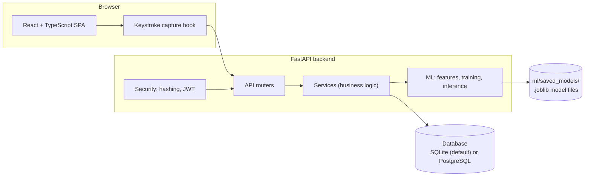

# 04 — System Architecture

## Component overview



## Why this shape

- **Clean separation of concerns.** The frontend never computes features or makes an
  authentication decision — it only captures raw timing and displays results. All
  scoring logic lives in one place (the backend), so there is exactly one
  implementation of "how a login is judged" to reason about, test, and audit.
- **Services own the logic; routers stay thin.** `app/api/*.py` files parse requests,
  call a service function, and shape a response. `app/services/*.py` files contain the
  actual decision-making (e.g. `auth_service.evaluate_login`). This keeps HTTP concerns
  (status codes, schemas) separate from business rules, so the business rules can be
  unit-tested without spinning up the web framework at all.
- **ML code is a library, not a script.** `app/ml/*.py` exposes plain functions
  (`extract_features`, `train_user_verification_model`, `verify_typing_pattern`, …)
  callable both from API endpoints and from tests, with no duplicated logic between an
  "offline" training script and the "online" API path.

## Request lifecycle: login

1. `POST /api/auth/login` arrives with `{email, password, events}`.
2. `auth_service.evaluate_login` verifies the password hash first (`security/passwords.py`,
   Argon2). If wrong, the typing sample is not even evaluated — the response is
   generic ("Incorrect email or password") so the API never confirms which field failed.
3. If correct and typing events were provided, `keystroke_service.store_typing_sample`
   validates the raw events against the configured phrase and calls
   `ml/feature_extraction.py` to compute the numeric feature vector.
4. If the user's typing profile is not yet `ready` (too few enrollment samples), the
   login succeeds on password alone and typing is not scored.
5. Otherwise `ml/inference.verify_typing_pattern` loads the user's active trained model
   (or falls back to the statistical baseline) and produces a similarity score.
6. The score is mapped to a similarity label and risk level via the configured
   thresholds, combined into a final decision, and logged as an
   `AuthenticationAttempt` row — regardless of outcome, so the audit trail is complete.

## Data flow: enrollment → training

```
Typing samples (TypingSample, raw events)
        │  app/ml/feature_extraction.py
        ▼
Feature vectors (TypingFeature, 24 numeric features)
        │  app/ml/dataset.py  (build positive/negative sets, avoid leakage)
        ▼
Train/test split + cross-validation
        │  app/ml/training.py (RandomForest, SVM, LogisticRegression)
        ▼
Evaluated candidate models (accuracy, F1, FAR, FRR, confusion matrix, importances)
        │  best model by F1 (tie-break: lower FAR) marked active
        ▼
Persisted: ml/saved_models/*.joblib + model_versions row (DB)
```

## Why SQLite by default, PostgreSQL as an option

The project uses plain SQLAlchemy ORM with no dialect-specific column types, so the
exact same code runs unmodified against SQLite or PostgreSQL. SQLite is the default
because it requires no installation or running service — the project should be
runnable on "a normal student development machine" with nothing beyond Python and
Node.js. `docker-compose.yml` starts a real PostgreSQL instance for anyone who wants to
exercise that path (e.g. to demonstrate production-realistic database choice in a viva).

## Why REST, not GraphQL or gRPC

The API surface is small, resource-oriented, and consumed by exactly one client (the
bundled SPA). REST with FastAPI's automatic OpenAPI docs gives a simple, inspectable,
well-understood contract without the additional schema/tooling overhead GraphQL or
gRPC would add for no real benefit at this scale — consistent with the project's
explicit instruction to avoid unnecessary complexity (see
[13_Future_Scope.md](13_Future_Scope.md) for where that calculus might change).
